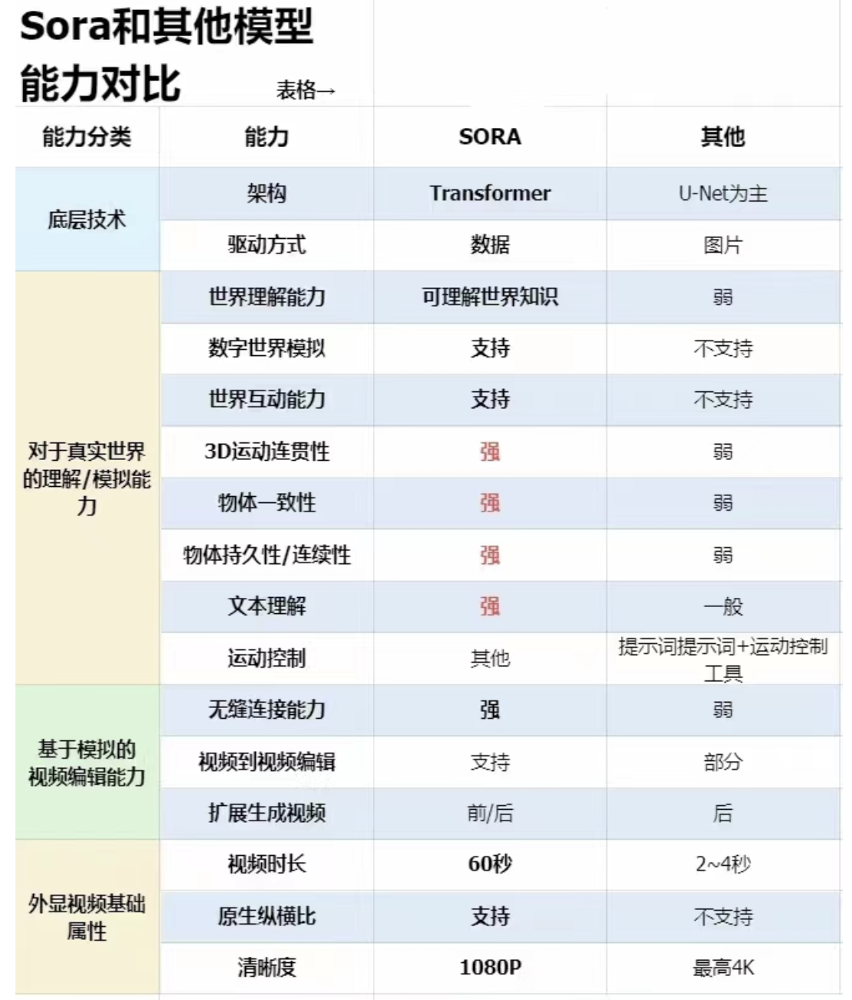
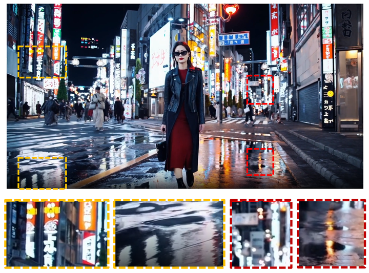
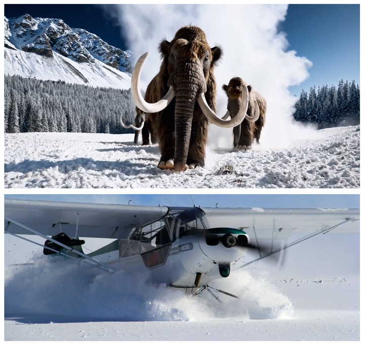
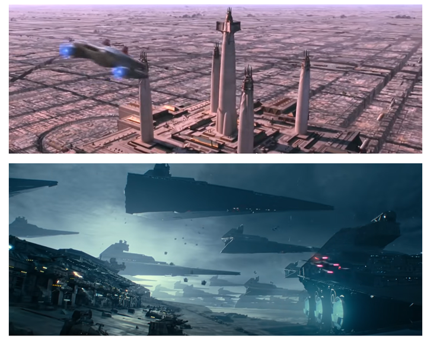
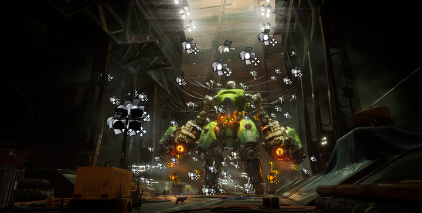
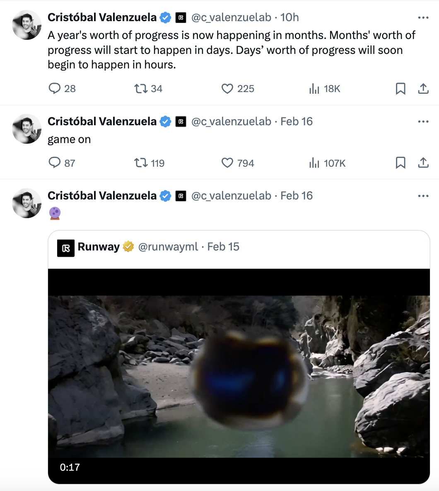
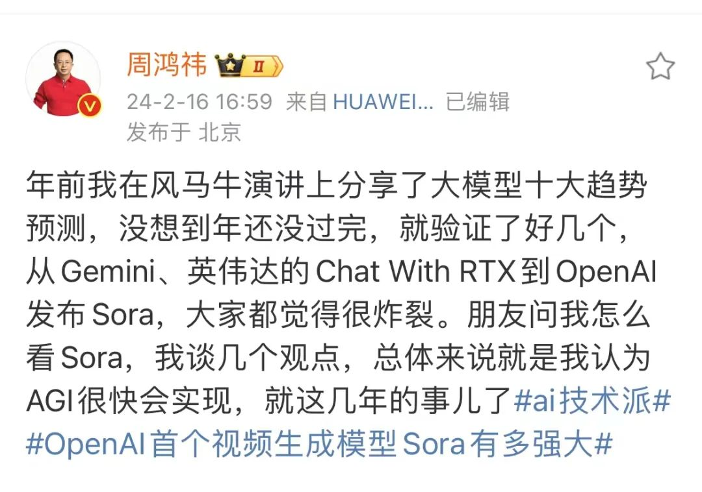
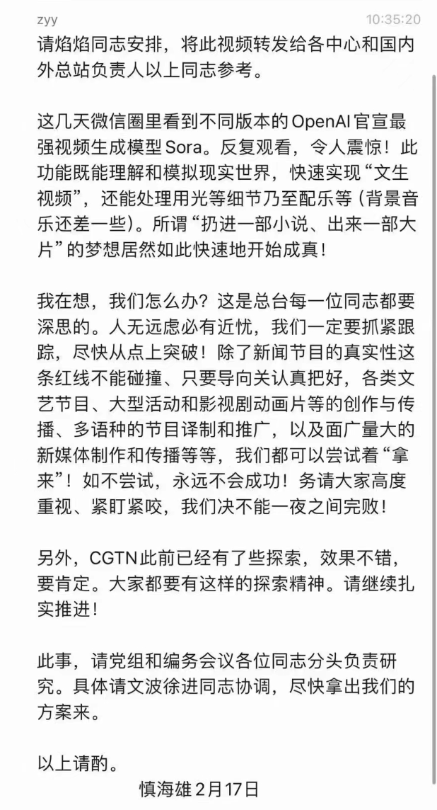

# Sora 学习手册 持续更新


适用人群：互联网AI视频爱好者，想在人工智能风口拿到结果的人

首发时间：2024 年 2 月 19日

更新时间：2024 年 2 月 19日

内容出品人： @DIRI

使用建议：如果需要快速定位到精确内容，可以使用快捷键 Ctrl +F/Command +F 的形式，搜索关键字/词，查找你想要的内容。

持续更新 Open AI 的 Sora 模型相关**资讯动态，研究报告，赚钱案例，实用场景**等板块内容，永久免费在线查看，欢迎收藏转发支持

文末有惊喜


## **Sora基本介绍**

2024 年 2 月 16 日，Open AI 宣布推出全新的生成式人工智能模型 Sora

在央视的报道中，也称其为 **首个视频生成模型**

如果让我描述它的话，只能用俩个词 **震撼！牛逼！**

这绝对又是下一轮的风口，如果需要在AI领域赚一波钱的兄弟们，一定不要错过！

据了解，通过文本指令，Sora 可以直接输出长达 60 秒的视频，并且包含高度细致的背景、复杂的多角度镜头，以及富有情感的多个角色。 这意味着，继文本、图像之后，OpenAI 将其先进的 AI 技术拓展到了视频领域

OpenAI 亦表示，Sora 是能够理解和模拟现实世界的模型的基础，这一能力将是实现 AGI（通用人工智能）的重要里程碑。

对于 OpenAI 视频生成模型的出现，业内其实早有预期，但仍有人评价称“比想象中来得更快”，亦有人振奋地表示“我们真的看到新工业革命来临”


**如何获得Sora使用权限**

截止至2024年2月18日，Sora目前没有公开测试，也没有内测申请渠道，国内是没有渠道可以去尝试的！

Sora的测试帐号仅限于早期付费用户，只有极少数用户可以通过特殊申请渠道获得权限

可以生成最多180秒无限制关键字的视频，或是300秒受关键字限制的视频。

目前观察到，只有前60秒的视频看起来比较正常。

生成的视频内容归OpenAl所有，严禁发布，否则将被永久封号。

使用帐号的条件非常苛刻，必须同时拥有美国信用卡、美国地址、美国注册的计算机设备以及非主机类IP地址，任何一个条件不符合都将导致封号。


## **博主解读Sora**

[**Sora来了，我们离AI模拟世界还有多远**](https://q0nlfech1h.feishu.cn/wiki/NNY2w7rrXic4eZkbWDKcLlXynvb)

[OpenAI 发布文生视频模型 Sora，AI 能理解运动中的物理世界，这是世界模型吗？意味着什么？](https://q0nlfech1h.feishu.cn/wiki/DfN0wncP9iyh6Kk57jacTcIpnfb?from=from\_copylink)

[OpenAI 发布文生视频模型 Sora，将对 AI 视频行业、传统的影视公司等造成哪些影响？](https://q0nlfech1h.feishu.cn/wiki/VQMxw6mBii647qkiKvzc6uqPnbe)

## **模型效果对比**

**Sora 的 6 大优势**

《每日经济新闻》记者经过对官方技术报告的梳理，总结出了 Sora 的 6 大优势：

**（1）准确性和多样性：**Sora 的显著特征之一是能够准确解释长达 135 个单词的长提示。它可以准确地解释用户提供的文本输入，并生成具有各种场景和人物的高质量视频剪辑。这一新工具可将简短的文本描述转化成长达 1 分钟的高清视频。它涵盖了广泛的主题，从人物和动物到郁郁葱葱的风景、城市场景、花园，甚至是水下的纽约市，可根据用户的要求提供多样化的内容。

**（2）强大的语言理解：**OpenAI 利用 Dall-E 模型的 re-captioning（重述要点）技术，生成视觉训练数据的描述性字幕，不仅能提高文本的准确性，还能提升视频的整体质量。此外，与 DALL·E 3 类似，OpenAI 还利用 GPT 技术将简短的用户提示转换为更长的详细转译，并将其发送到视频模型。这使 Sora 能够精确地按照用户提示生成高质量的视频。

**（3）以图/视频生成视频：**Sora 除了可以将文本转化为视频，还能接受其他类型的输入提示，如已经存在的图像或视频。这使 Sora 能够执行广泛的图像和视频编辑任务，如创建完美的循环视频、将静态图像转化为动画、向前或向后扩展视频等。OpenAI 在报告中展示了基于 DALL·E 2 和 DALL·E 3 的图像生成的 demo 视频。这不仅证明了 Sora 的强大功能，还展示了它在图像和视频编辑领域的无限潜力。

**（4）视频扩展功能：**由于可接受多样化的输入提示，用户可以根据图像创建视频或补充现有视频。作为基于 Transformer 的扩散模型，Sora 还能沿时间线向前或向后扩展视频。从 OpenAI 提供的 4 个 demo 视频看，都从同一个视频片段开始，向时间线的过去进行延伸。因此，尽管开头不同，但视频结局都是相同的。

**（5）优异的设备适配性：**Sora 具备出色的采样能力，从宽屏的 1920x1080p 到竖屏的 1080x1920，两者之间的任何视频尺寸都能轻松应对。这意味着 Sora 能够为各种设备生成与其原始纵横比完美匹配的内容。而在生成高分辨率内容之前，Sora 还能以小尺寸迅速创建内容原型。

**（6）场景和物体的一致性和连续性：**Sora 可以生成带有动态视角变化的视频，人物和场景元素在三维空间中的移动会显得更加自然。Sora 能够很好地处理遮挡问题。现有模型的一个问题是，当物体离开视野时，它们可能无法对其进行追踪。而通过一次性提供多帧预测，Sora 可确保画面主体即使暂时离开视野也能保持不变。

## **Sora 可能带来的影响**

如果 Sora 能够真正意义上实现文生视频，可能会带来哪些影响呢？

1、没有演员的影视作品出现，对演员来说是个小挑战，将出现真正的“虚拟偶像”，此前的二次元人物并没有真正达到“偶像”的级别。

2、利好编剧行业，剧本、文本创作力成为核心竞争力。

3、Sora 可能才是真正的文生视频，此前的文生视频大多只有 2 秒，仅仅是对象的小幅度移动。

4、OpenAI 继续拉大领先程度，对众多还在进行大模型测试打分 pk 的厂商，构成压力。

5、直接的影响是影视行业，特别是特效行业。使用 AI 来制作一些特效和高风险的镜头，可以大幅降低拍摄成本，也可以避免很多危险。

6、摄影师行业也会受到影响，用文本来生成一些视频，可以省去很多拍摄工作。

7、短视频流行开以后，视频剪辑师也随之成为一个热门职业。如果视频剪辑的工作可以用 AI 来代替，可能会有很多视频剪辑师失业。

8、对于很多短视频创作者来说，用 AI 来替代繁琐的剪辑工作，可以大幅提高工作效率。

9、很多歌手拍摄 MV 都是大成本制作，如果可以用 AI 来生成所需要的 MV 画面，也可以省去很大一部分制作成本。10、另外，如果真正意义上的文生视频得以实现，可能会有不法份子利用这项技术实施新手段的违法犯罪。

不过，从 Sora 官网目前展示的视频画面效果来看，效果还没那么逼近真实，短期内不会产生让行业失业，但会有辅助作用，做个动画片应该问题不大。

在 Sora 官网，OpenAI 表示，Sora 是能够理解和模拟现实世界的模型的基础，OpenAI 相信这一能力将是实现 AGI 的重要里程碑。

至于 Sora 文生视频到底能带来多大影响，会不会翻车，还需要“让子弹飞一会儿”。

## **技术拆解**

**官方技术报告文（中英文对照）**

OPENAI-SORA+技术文档总结+中英对照原稿.pdf

**腾讯科技拆解文**

[**OpenAI 王炸模型引爆科技圈，我们第一时间深读了官方技术报告**](https://mp.weixin.qq.com/s/gSvxvOVqYtGcKw0ueDGbFA)

**阿里巴巴分析文**

[**复刻 Sora 有多难？一张图带你读懂 Sora 的技术路径**](https://mp.weixin.qq.com/s/xP46EocNg1x7IlTN\_iF8kw)

**素人笔记**

[**Sora 是怎么训练出来的 | 笔记**](https://mp.weixin.qq.com/s/exFp0nP8vpSc2duQILHbvA)

**技术解读（思维导图）**

#### **参考论文**

[**Sora 参考论文**](https://huggingface.co/collections/pxiaoer/sora-65d0e2db17e2b305e0fc572e)

## **热点讨论**

#### **Sora将对视频行业、影视公司等造成什么影响？**

投资人：悬着的心终于死了

简单来说，生成效果非常好，技术力非常强

但依然需要创意、审美、构图，创作者会有更加趁手的工具，而不是被替代

对一些工作肯定是有影响的，比如前期的分镜创作、远景里不重要的群演、一些视频画面的插帧特效…

将来有可能不再需要那么多的实拍和人力，甚至是一些风格化的改变，类似于调色一样，直接给视频套一个 LoRA…等等

AI 能很大程度上填补这些工作，具体的影响还要看圈内人的反应，至少我们看到了希望。

我记得郭帆对这些新技术非常感兴趣，考虑到流浪地球3，说的是 2027 年，按照现在的进度，我觉得大概率会用到很多人工智能技术

#### **Sora出现了，国内文生视频模型预计何时出现？**

@平凡

早就有了呀，前两天我还用通义千问App生成了上面这个视频。

通义千问推出「一张照片生成拜年舞蹈视频」功能，背后涉及哪些技术，难度如何？

当然，它并不是通过文字生成的视频，而是图片生成的视频，但本质上是一样的。

视频说白了就是连续的图片组成，你把1440张图片连续播放，每一张图片占1帧的时长，那这就是一分钟的视频。

理论上来说，只要能生成图片的多模态大模型，就可以生成视频。

所以我说国内有，还不少。但是唯一的差别就是视频的质量，这个就差距不小了。

**周鸿祎称 Sora 对电影工业不是打击，能激发更多人的创作力，如何评价他这一观点？**

@呵呵

摄像头解放了现实，人工智能解放了想象。

在抖音里，内容链条的链主是算法加持的分发，由分发来激励上游的内容制作。但现在的sora世纪里，内容链条的链主变成内容制作，由内容制作来重新塑造内容的分发和消费。

几个月前导演陆川说，**人工智能将使一般人竞争上岗的门槛越来越高，但那些极具创意的人把创意落地的门槛越来越低。**

假设sora发展到极致就是，人直接说话就可以生成一部电影，如果加上脑机接口，都不需要说话，你想什么，那电影就出来了，其他人直接看得到你脑袋里的山崩地裂，以及美人销魂。那么摄影、演员、灯光都不需要了，甚至导演都不需要了。

**你的想象力就是编剧和导演，那些创意的源头，就是产生故事的人，他们可以甩掉所有人，跨过所有中间环节，直接把电影做出来。**

所以未来的创意行业可能会分两个极端，一个极端是极其的虚，所有创意大师天马行空，借助sora和脑机接口把创意零损耗的给人看。

借助Sora，更多平凡人将可能成为电影大师。因为每个人，再平凡的人，他都经历过挣扎，他就知道某些事情，愚者千虑必有一得。他都可以把他深刻的体验表现出来。从这个角度讲，接下来的时代确实每个人都可能红五分钟。

昨天有人看到sora就说，现实不存在了，因为我分不出什么是现实什么虚幻，**但我觉得可以反过来理解这一点，只有现实，只有真正的现实，才能对抗虚幻。**

**Sora能理解运动中的物理世界，这是世界模型吗？意味着什么？**

@薛天帆

我第一次看到Sora这个视频生成的效果真的是被彻底震惊到了。我是猜到视频生成这几年会有快速的发展，但是没有想到居然会不到一年的时间就已经做到这个地步，实在是太厉害了。

厉害的地方就不分析了，其他的博主已经已经说过很多。即使是研究人员，自然也要看看还有哪些不足的地方，这样之后的研究才有方向。这里就鸡蛋里面挑骨头，看看哪些细节还没有做到完全真实。先迭个甲，这里不是要攻击Sora的结果，反而正因为视频生成做到如此真实，我们才能够有机会去分析那些细微的不真实的点。

首先是光影，这里就把OpenAI放出来的第一段做例子。这个结果非常让人震撼，整个图片光影很漂亮，尤其是地面水的反射。但仔细观察，就会发现很多地方的反射有错误，例如左下角黄色框出来的反光是两个细灯箱，一个粗灯箱，但是上面实际的广告牌却是三个细灯箱。又如右下角红色框出的橙色反光，其实上面是没有对应的橙色灯箱的。

https://openai.com/sora

然后细节，这里用这个猛犸象的视频做例子。这个例子中OpenAI着重炫技的就是猛犸象的毛发，无论是光影还是细节几乎都无可挑剔，但是美中不足的是猛犸象走路时溅起的雪花。滑过雪的都知道，雪地上的溅起的雪一般不会起的太高，而且会呈现明显颗粒状，而视频中的雪花则像雾一样飘起来。下面放一个真实的滑翔机在雪地的图片做对比就一目了然了。

上图：https://openai.com/sora。下图：https://generalaviationnews.com/2021/01/10/flying-with-skis/

然后交互，这里用这个各大平台转载的海盗船在咖啡中的例子。这里无论时咖啡的飞剑还是海盗船的风帆都非常真实，但是船在海中漂流的却偶尔有些失真，尤其这一小段，注意右侧的船似乎是悬浮在空中漂移，而不是真的在海上漂流。还是作为对比，用著名动画"各国是如何打仗的"里面的船在海上漂流的视频，就可以看出区别。

https://openai.com/sora

短片：《各国是如何打仗的》

还有三维一致性，这里用这一段非常漂亮的日本街头视频，能够把这么复杂的城市场景三维结构仅仅通过视频信息建模出来实属不易。但左侧的樱花在某些帧可以明显看出有一些是悬浮在空中，这也是因为单单二维视频并没有真正的三维结构，所以从某些角度看上去就容易比较奇怪。还是作为对比，放一个真正三维游戏中的森林场景的渲染。

https://openai.com/sora

来源：最后的生还者

最后就是复杂的运动。这段视频中这只可爱的猫在逗主人的时候，明显突然间多变出了一个爪子。

说了这么多，但还是最开头的说的，即使如此，这个结果也是非常让人震惊，让人感受到了视频生成的无限潜力，未来也许很多的短视频，动画，电影，还有游戏，各种各样内容生成，都是可以由AI辅助完成。

最后也是一点私活。大家可能觉得我说这么多有点吹毛求疵了，这些细节的区别谁会在意呢？但我却不这么觉得。如今各行各业都在卷，内容制作这一块也是卷的非常厉害。头几年一个手机一个三脚架就可以录视频做博主，而如今博主们都是各种专业录影。电影电视剧短视频游戏更是如此，当年非常牛逼的特效在现在看来都是5毛钱特效了。例如这里对比一下同是星球大战系，99年出的魅影危机和19年出的天行者崛起。

两部星球大战对比，上：魅影危机，下：天行者崛起

而为让提升效果，大家也在拼命抠细节，例如就是游戏里面打光，就这么一张机甲图，为了看上去好看，看里面放了多少个光源。也正是因为效果越做越好，观众们的眼睛也会被养的越来越刁，对于品质追求也越来越高。而内容创作又是一个赢者通吃的游戏，最好的内容获取了绝大部分的流量，会逼迫大家都想尽办法去卷内容中的每一个细节。

By Peter Tran. https://www.artstation.com/artwork/L352gk

但这种内容细节的极（nei）致（juan）追求，对于做内容生成的研究员来说反而是一个难得得机遇。因为上面说的每一个细节，光影，细节，动作，交互，三维，都需要一个一个仔细研究逐个击破，反而会鼓励更多差异化得工作出现，毕竟在每一个维度上的进步，都可能比别人做出质量更高一点的内容。今天看到朋友圈很多做内容生成研究的研究员在哀嚎，说OpenAI又把大家卷死了，其实感觉大可不必。

4\. **如何利用Sora搞钱**

4.1 **搞流量**

流量=钱，AI 领域新产品的出现总会伴随着所有人的关注，Sora 在视频生成领域的出现不亚于大语言模型的 GPT-4.0，此时的流量生意总是能最先拿到结果的生意，现在大把的 Sora 公众号爆文，爆款短视频，用来获取流量非常可观，咱们先不管是捧还是骂，话题度在。

4.2 **卖账号**

**目前的 Sora 模型还没有对普通用户开放，**不过大家都已经迫不及待了。就像当年的 ChatGPT 一样，OpenAI 的账号销售一定能继续大卖。只是国内的大语言模型和国外的相比，许多普通人并不能进行完整地分辨，等到文生图的时候，差距逐渐显现，等到真正 Sora 对普通用户开放的时候，国内外的差距就比较明显了。这个时候，会有更多的人想用上 Sora。

4.3 **卖课程**

课程永远是 AI 行业不缺的赚钱渠道，目前 AI 行业做课程赚的最多的当属李一舟，据说年入 1 个亿，而 Sora 还没开放账号，已经有课程上线了，这就是“搞钱”的原动力！AI 工具使用的课程会长期成为 AI 行业的赚钱赛道，也算是先行者的付费布道，课程要在有产品以后发布。

4.4 **套壳**

众所周知的原因，国内乃至全国的套壳网站和应用众多，只要你有一定的流量或者推广渠道，套壳网站会为你持续带来收益。目前 Sora 的推出，已经有人开始通过套壳网站赚到第一笔年费了。

目前的套路是注册含有关键词 sora 的域名，同时应用商店提交 Sora 相关的 app，同时接入 Runway 等产品的 API，先把流量跑出来，等到 Openai 发布 Sora API 的时候，再进行切换，从而丝滑过渡。

4.5 **投资**

如果你是二级市场投资客，那么关注 AI 行业一定能让你赚到（中国股市可能除外），Sora 的推出，利空哪家公司呢？

Adobe! 受 Sora 发布的影响，Adobe2 月 16 日当日跌幅达到 7.41%。如果此前做空 Adobe，那是要赚上一笔了。

4.6 **提示词交易**

去年的 AI 绘画提示词交易很火，今年 AI 文生视频的提示词一定也会有市场，从提示词打包交易到提示词交易平台。

日光之下并不新事。

4.7 **剧本创作**

文生视频提示词的升级是视频的剧本创作，无论是长视频还是短视频，更依赖剧本的创作，这更依赖于创作者。

从这个角度来看，Sora 的发布是非常利好内容创作者。如果把未来的视频创作比如电影创作的话，那么编剧的权重在进一步强化，或者是编剧、导演和制片在进一步融合。大团队面临挑战，而小团队的机会在进一步上升。

4.8 **视频制作**

视频生成这个业务勿庸多言，Sora 就是干这个的，大家只要充分地学习和试错，做出更好的视频（质量和数量），赚钱的机会一定有。在 AI 绘画时代已经切入的团队和个体会更有机会，毕竟前期的铺垫已经足够了，学习成本很低。

4.9 **原业务优化**

AI 工具对生产力的提升是毋庸置疑的，如何直接用 AI 工具进行商业变现，不如考虑在原有的业务上进行 AI 化。

商业的竞争说到底还是生产率的竞争，成本打下来了，自然就有价格调整的空间了，也就有更大的获客和竞争优势了。只要是涉及视频类的公司（我说的是“涉及”，这与 08 部分并不一致），都应该重视 Sora 的使用，考虑如何将其融入进原业务。

4.10 **企业服务**

部分做传统行业的公司并没有自我 AI 化的能力，那么就可以有相关的 AI 团队来进行咨询服务，从做事的本质上来讲有点像以前的咨询公司，只是这样的咨询公司对 AI 理解和使用更深入，同时这样的咨询公司一定是高度关注和践行 RPA（机器人流程自动化）。

除此以外，企业服务的另一种商业化形式就是商业化的软件工具，在行业领域内融合专业知识和生产流程，再利用像 Sora 这样的 API 实现相应的生产功能，最终商业变现。

4.11 **Sora+电商**

用 Sora 生成各类电商产品宣传视频投流，或者制作各类短视频，嵌入产品进行推广，参考 AI 模特变装、虚拟试衣等。

4.12 **开发与 Sora 相关的网站或工具**

针对具备技术背景的人士，开发与 Sora 相关的网站或工具，如导航网站或 AI 写真工具，以此获取收益。

5\. **名人观点**

**特斯拉 CEO 马斯克**

**Runway 联合创始人兼 CEO Cristóbal Valenzuela**

感慨后浪拍前浪，以前需要花费一年的进展，变成了几个月就能实现，又变成了几天、几小时

**360 董事长周鸿祎**

**前阿里副总裁贾扬清**

真的非常牛。”他认为“对标 OpenAI 的公司有一波被其他大厂 fomo（害怕错过）收购的机会”，“开源还需要一段时间才能 catch up”，算法小厂“要不就算法上媲美 OpenAI，要不就垂直领域深耕应用，要不就开源”，并预言“infra 的需求继续会猛增”。

**中央电视台台长慎海雄**

6\. **相关报道**

**商业博主刘润**

[**刘润：OpenAI 全新发布的 Sora，到底意味着什么？**](https://mp.weixin.qq.com/s/NLi0-N6um818-D-srFnFyQ)

**AI 博主卡兹克**

[**OpenAI 全新发布文生视频模型 Sora - 现实，不存在了**](https://mp.weixin.qq.com/s/C-wSkjzkNsX0EFaJFTv38w)

**量子位**

[**效果炸裂！OpenAI 首个视频生成模型发布，1 分钟流畅高清，网友：整个行业 RIP**](https://mp.weixin.qq.com/s/K6ZXhH6xHsw0Nfj5TnKCXw)

**钛媒体**

[**许四清：Sora 进一步拉大了中美 AI 差距**](https://mp.weixin.qq.com/s/O63VYPdkQTvoQjYYqDHKBQ)

**新智元**

[**OpenAI 首个 AI 视频模型炸裂登场，彻底端掉行业饭碗！60 秒一镜到底惊人，世界模型真来了？**](https://mp.weixin.qq.com/s/93z4Ta91yLv7PB1pnBM9mg)

**清华大学**

[**OpenAI 发布文生视频模型 Sora，AIGC 视频时代正加速到来**](https://mp.weixin.qq.com/s/OQVLA6p9sXnivY6BQaaLTQ)

**央视网**

[**OpenAI 首个文生视频模型亮相，你觉得咋样？**](https://mp.weixin.qq.com/s/PS\_WfoOX35XoScgoQJJVcA)

**CSDN**

[**OpenAI 大杀四方，Sora 彻底革了视频的命**](https://mp.weixin.qq.com/s/1iqYtq13DniEJxTLBwTJmg)

7\. **个人思考**

老黑玩 AI 一年多，几个心得体会分享给大家：

AI 不是风口，是未来深入到生活，工作，乃至思考的必备工具。

AI 的技术迭代日新月异，你可以怀疑当前的缺陷，但你不能怀疑 AI 不断智能的趋势

AI 进化速度太快，其实会有人为干预，你无法想象 AI 来的太快，

普通人多研究 AI 应用，把 AI 当做自己的思考一部分，这样才能保持不被淘汰

不要过度恐慌 AI 带来的变革，但是容易被替代的岗位也不要太乐观

普通人完全可以参与 AI 带来的风口红利，也许你不懂技术，但是你可以认真研究应用场景，甚至探索新的应用场景，给更多的人做示范案例

多看看国外的 AI 技术变革，国内一直在追国外的技术，其实差距还不止一点点，每次革命性的 AI 节点都是国外技术推动的

在 AI 赛道创业，明显的是出海的创业项目增多了，这是很好的一个选择，海外市场比国内大得多，这是少有的国内国外一致进行的技术革命

国内的各大内容平台，在迎合 AI 生产内容，甚至是不得不接受 AI 生产内容，因为这是趋势

谁掌握了先进的生产工具，谁就是金字塔顶尖的那批人，这就是 AI 带来的机遇。

8\. **延伸学习**

认准 **老黑** 出品的 **AI知识库**，多平台同步更新

| 
<strong>飞书</strong>

https://q0nlfech1h.feishu.cn/wiki/space/7233666729904193588?ccm_open_type=lark_wiki_spaceLink&#x26;open_tab_from=wiki_home
 | 
<strong>语雀</strong>

<strong>[该类型的内容暂不支持下载]</strong>
 | 
<strong>Gitbook</strong>

<strong>[该类型的内容暂不支持下载]</strong>
 |
| ----------------------------------------------------------------------------------------------------------------------------------------------------------- | ---------------------------------------------------------------- | --------------------------------------------------------------------- |

9\. **AI 学习交流社群**

**\[该类型的内容暂不支持下载]**

| 

<strong>微信扫码进群领资料</strong>
 | 

<strong>微信扫码加好友（微信 whoiam-an）</strong>
 |
| ------------------------------------------------------------------------------------------------------- | ------------------------------------------------------------------------------------------------------------------- |

**觉得有用欢迎留个赞**
